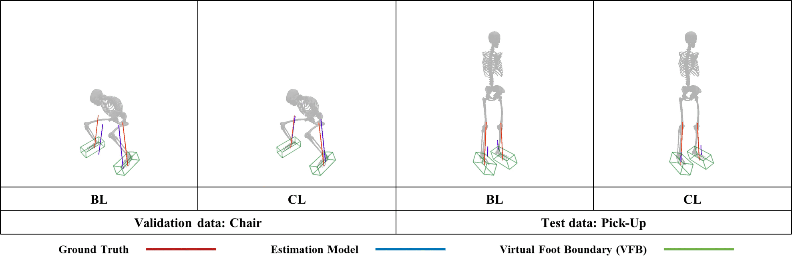

# Center-of-Pressure-Constrained GRF Estimation

> **Related publication**
>
> Jo, J., Kim, K., Kang, M. et al.
> **Joint torque estimation from daily living motion for passive sarcopenia monitoring in older adults**.
> *Journal of NeuroEngineering and Rehabilitation* (2026).
> Published online: 2026-04-05.
> https://doi.org/10.1186/s12984-026-01962-3
>
> This repository contains the **CoP-constrained GRF estimation component**
> used in the published study. It focuses on the GRF/CoP estimation module and
> does **not necessarily include the full MAISE clinical analysis pipeline**
> reported in the paper.

---

## 🌟 Highlights

-   **CoP-Constrained Learning** We introduce a **CoP Limiter**, a simple layer that guarantees physically valid predictions. It constrains the predicted Center of Pressure (CoP) to remain within a **Virtual Foot Boundary (VFB)** defined by anatomical landmarks.
-   **Improved Accuracy & Generalization**: Reduces CoP prediction error by **up to 60.7%** on validation data and demonstrates robust cross-domain generalization in zero-shot tests, improving GRF error by **up to 6.5%** without any fine-tuning.

---

## 📝 Summary

Ground Reaction Force (GRF) is an essential element for dynamics simulation in human motion analysis. The gold-standard for its measurement, the force plate, is **expensive, lab-bound, and can disrupt natural motion**. While recent learning-based methods have been proposed to predict GRF from motion data alone, they often **estimate physically implausible forces for unseen data** (BL), such as predicting forces originating outside the foot.

This study introduces the **CoP Limiter** (CL), a novel layer designed to guarantee physical plausibility. The layer constrains the predicted CoP to lie **within a subject-specific Virtual Foot Boundary (VFB)** defined from anatomical landmarks without changing the base model architecture.

-   **Training dataset** [AddBiomechanics Core](https://addbiomechanics.org/download_data.html) — 24 M frames, 273 subjects, 70 h motion-capture + kinetics (accessed **2024-09-01**).
-   **Validation set** Hold-out split from the AddBiomechanics Core Dataset.
-   **Zero-shot test** 28 older adults performing four ADLs (5-Times Chair Stand, Chair Stand, Pick-Up, Step-Up) — _no fine-tuning_.
-   **Encoders** Feed-Forward (FFN), Mamba (SSM), Transformer (Attention) — 117 M parameters each, window = 100 frames.

---

## 🔍 Results

### Quantitative: Baseline (BL) vs CoP-Limiter (CL)

| Cohort         | Encoder     | CoP (m)<br>BL | CoP (m)<br>CL | GRF (N/kg)<br>BL | GRF (N/kg)<br>CL |
| -------------- | ----------- | ------------- | ------------- | ---------------- | ---------------- |
| **Validation** | FFN         | 0.056         | **0.022**     | 0.611            | **0.615**        |
|                | Mamba       | 0.034         | **0.019**     | 0.345            | **0.345**        |
|                | Transformer | 0.034         | **0.020**     | 0.328            | **0.326**        |
| **Zero-shot**  | FFN         | 0.075         | **0.038**     | 1.119            | **1.121**        |
|                | Mamba       | 0.057         | **0.033**     | 0.844            | **0.806**        |
|                | Transformer | 0.057         | **0.034**     | 0.804            | **0.752**        |

### Qualitative: Baseline (BL) vs CoP-Limiter (CL)



> Red = force-plate GRF, Blue = estimate, Green box = VFB.

---

## 🚀 Quick Start

---

### Train

```bash
python src/main.py train \
    --dataset-home  Data/ \
    --config-path   config/Journal/Transformer_CL.yaml \
    --data-loading-workers 3
```

### Inference

```bash
python src/main.py inference \
    --dataset-home  Data/dev \
    --config-path   config/Journal/Transformer_CL.yaml \
    --result-dir    Data/dev \
    --save-opt      all \
    --sample-rate   100 \
    --cutoff-frequency 6 \
    --lowpass       True \
    --gaussian-edge-filter True \
    --model-selection dev \
    --sliding-window-inference True
```

### Visualize

```bash
python src/main.py visualize \
    --dataset-home  Data/dev \
    --config-path   config/Journal/Transformer_CL.yaml \
    --sample-rate 100 \
    --cutoff-frequency 6 \
    --model-selection dev \
    --mode world_frame \
    --viz-origin False --viz-com False --viz-footbox True \
    --sliding-window-inference False
```

### Evaluation

```bash
python src/main.py evaluate \
    --dataset-home  Data \
    --config-dir    config/Journal \
    --result-path   docs/eval_results.xlsx \
    --data-loading-workers 4
```

## 📄 Citation

> **Built on** : This repository is a derivative work of [keenon/InferBiomechanics](https://github.com/keenon/InferBiomechanics)

If you use this repository, please cite the associated paper:

```bibtex
@article{jo2026joint,
  title   = {Joint torque estimation from daily living motion for passive sarcopenia monitoring in older adults},
  author  = {Jo, Jaebeom and Kim, Kihyun and Kang, Min-gu and others},
  journal = {Journal of NeuroEngineering and Rehabilitation},
  year    = {2026},
  doi     = {10.1186/s12984-026-01962-3}
}
```
